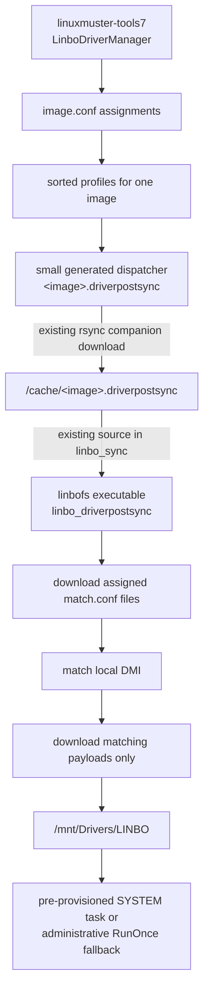

# Native Windows driver profiles for LINBO

- Status: implementation workbench; first reference-server end-to-end test passed
- Target branch: `main`
- Planning base: `e17d008` (`main` and `7.4`, `linuxmuster-linbo7` 7.4.6)
- Related components: `linuxmuster-tools7`, `linuxmuster-api7`

## Decision

Move the stable client-side driver deployment runtime into `linbofs`, but keep
one small, generated `.driverpostsync` companion per image.

The per-image file cannot be moved completely into `linbofs`: `linbofs` is a
global boot filesystem, while image assignments and profile lists are dynamic
server state. Embedding that state would require an `update-linbofs` rebuild
after every assignment and would expose unrelated image state to every client.

The target split is therefore:

- `linuxmuster-linbo7` owns one static `linbo_driverpostsync` runtime;
- `linuxmuster-tools7` remains the source of truth for profile assignments;
- Tools renders a minimal per-image dispatcher containing only the validated
  image name and the sorted profile names;
- the already existing LINBO download and execution path transports and
  sources that dispatcher;
- `linuxmuster-api7` remains unchanged.

This moves the already tested client-side implementation into LINBO; it does
not introduce a second, parallel implementation.

## Workbench implementation

The first implementation now exists on this branch as
`src/linbofs/usr/bin/linbo_driverpostsync`. It uses the positional contract
described below, keeps the existing transfer, matching, cache, Windows task
and registry behavior, and adds fail-closed validation for direct command
invocations. The existing `linbo_download_image` and `linbo_sync` files remain
unchanged.

A dependent linuxmuster-tools workbench branch replaces the generated full
runtime with the small dispatcher only. That change must not be released
before a LINBO package containing this executable has reached every client.
The linuxmuster API does not need a corresponding code change.

## Existing contracts to reuse

| Concern | Existing implementation | Decision |
|---|---|---|
| Companion download | `src/linbofs/usr/bin/linbo_download_image` downloads `driverpostsync` | Reuse unchanged |
| Companion execution | `src/linbofs/usr/bin/linbo_sync` sources the hook after the regular postsync while `/mnt` and `/cache` are mounted | Reuse unchanged in the first PR |
| LINBO environment | `/usr/share/linbo/shell_functions`, `/.env`, `/conf/linbo` | Source and reuse |
| Interrupt handling | existing traps from `shell_functions`; the current driver runtime uses direct `rsync --timeout=120` calls | Preserve for the extraction; evaluate `interruptible` separately |
| Logging | `/tmp/linbo.log`, `sendlog`, and the existing driver log copied to `/cache` | Reuse |
| Offline registry | `/usr/bin/linbo_patch_registry` and the existing `reged` payload | Reuse |
| Driver profiles | `/srv/linbo/drivers/<profile>` managed by `LinboDriverManager` | Keep server-side |
| Image assignments | manager-owned `image.conf` files and shared lock | Keep server-side |
| Matching rules | canonical manager-owned `match.conf` files | Keep the existing format |
| Windows installation | task/marker contract expected by the current Tools runtime, but not delivered by LINBO 7.4.6 | Keep as an external prerequisite or separate bootstrap PR; preserve the fallback |
| HTTP access | existing thin linuxmuster API endpoints | No API change |

The download and source support was merged before this proposal. It must not
be implemented again under another name.

## Target architecture



### Server state

```text
/srv/linbo/drivers/
├── lenovo-l14-gen5/
│   ├── match.conf
│   ├── image.conf
│   └── ... extracted driver payload including at least one INF
└── dell-7490/
    ├── match.conf
    ├── image.conf
    └── ... extracted driver payload including at least one INF

/srv/linbo/images/windows-11/
├── windows-11.qcow2
└── windows-11.driverpostsync    # small generated dispatcher
```

### Client state

```text
linbofs
└── /usr/bin/linbo_driverpostsync       # static runtime

/cache
├── windows-11.driverpostsync           # dynamic dispatcher
├── linbo-driverprofiles/windows-11/    # last-known-good payload cache
└── linbo-driverpostsync.log

/mnt                                     # mounted Windows target
└── Drivers/LINBO/
    ├── pnputil-install.cmd
    └── ... matched driver payloads
```

### One image with many hardware classes

An image with 15 hardware classes still has exactly one
`windows-11.driverpostsync`. Its dispatcher passes 15 validated profile names
to the static runtime. The client downloads the 15 small `match.conf` files,
compares them with its own DMI values and downloads only the payloads of the
matching profiles. Neither the Windows image nor `linbofs` contains all 15
driver payloads.

## Rejected alternatives

### Embed profile assignments in `linbofs`

Rejected because assignments are dynamic and image-specific. Every profile
change would otherwise require a global `update-linbofs`, and clients would
receive state for unrelated images.

### Remove `.driverpostsync` and scan every profile from the client

Rejected because it would create a second assignment resolver. The client
would have to discover all server profiles and interpret every `image.conf`,
duplicating the authoritative server-side manager and increasing transfer and
failure scope.

### Add a new manifest, API route or service

Rejected because the existing image companion already transports exactly the
small amount of dynamic state required by the runtime. A new protocol would
duplicate an accepted LINBO mechanism.

### Put profile lists in `start.conf`

Rejected because it would add another configuration owner and require changes
to provisioning and start.conf parsing. The existing `image.conf` assignments
and generated companion already provide this relationship transactionally.

## Responsibility boundary

### Remains in `linuxmuster-tools7`

- school-aware inventory access through the existing `Devices(school)`
  provider;
- profile CRUD and canonical `match.conf` generation;
- server-side payload, INF, path, permission, size and collision validation;
- persistent `image.conf` assignments;
- locking, atomic writes, rollback and image lifecycle integration;
- deriving the sorted, deduplicated profile list for an image;
- `.driverpostsync` ownership checks and atomic publication;
- cleanup tombstone publication;
- reconciliation after restore, upgrade or repair;
- future archive import orchestration.

### Moves into `linuxmuster-linbo7`

- reading the real client DMI vendor and product;
- metadata-first download of assigned `match.conf` files;
- strict client-side parsing and matching of canonical rules;
- last-known-good metadata and payload cache handling;
- downloading only matching driver payloads;
- last-known-good cache activation for matched payloads;
- staging into the mounted Windows partition;
- generation of the deterministic `pnputil-install.cmd` file;
- checking the pre-provisioned SYSTEM-task marker;
- applying or removing the existing administrative RunOnce fallback with
  `linbo_patch_registry`;
- driver-specific runtime logging and cleanup.

### Remains outside both components

The Windows SYSTEM task is a golden-image bootstrap. LINBO 7.4.6 does not
deliver it. For the current implementation it must be installed manually in
the golden image; a supported delivery path requires a separate bootstrap PR
and an explicit merge and rollout order. LINBO has no existing mechanism that
can safely create this scheduled task offline with the required Windows
permissions, so this runtime proposal does not invent one. Without the task
and marker pair, the current administrative RunOnce fallback remains the only
installation path.

## Runtime command contract

Add one executable to the LINBO client filesystem:

```text
/usr/bin/linbo_driverpostsync
```

Proposed interface:

```text
linbo_driverpostsync <image> [<profile> ...]
```

- one or more profiles run the normal matching and deployment path;
- zero profiles run the cleanup/tombstone path;
- image and profile values are passed as separate arguments, never through
  `eval` or a parsed manifest;
- the client validates all path components again and fails closed;
- profile ordering is already deterministic on the server, but the runtime
  must not depend on ordering for correctness;
- the executable sources `/usr/share/linbo/shell_functions` like the existing
  `linbo_*` commands.

Expected exit status for the behavior-preserving extraction:

| Status | Meaning |
|---:|---|
| `0` | Completed successfully or skipped a non-Windows target |
| `1` | Invalid invocation or a matching, transfer, staging or cache operation failed |

As in the current hook, a non-zero `linbo_patch_registry` result is logged as
a warning and does not by itself change the runtime status. Some LINBO 7.4
versions do not return a reliable registry-helper status; making it fatal
would be a separate failure-semantics change.

The first implementation should preserve the current full-hook outcome and
logging before changing any failure semantics in `linbo_sync`.

At `e17d008`, `linbo_sync` sources `.driverpostsync` without assigning a
non-zero hook status to its own `RC`; the following `mk_boot` result can mask
that status. The executable's return value is therefore useful for direct
diagnostics and the dispatcher, but is not guaranteed to become the overall
sync result. Changing that behavior requires a separate, explicit decision.

## Generated dispatcher contract

For assigned profiles, Tools should eventually render only a small sourced
hook similar to:

```sh
#!/bin/sh
# Managed-By: linuxmusterTools.linbo.driver_hooks v1
# Image: windows-11
# Profiles: dell-7490, lenovo-l14-gen5

if ! command -v linbo_driverpostsync >/dev/null 2>&1; then
    echo "LINBO driver runtime is missing." >&2
    return 1
fi

linbo_driverpostsync "windows-11" "dell-7490" "lenovo-l14-gen5"
return $?
```

For an image without assigned profiles, Tools must publish a dispatcher that
calls the same executable with only the image argument:

```sh
linbo_driverpostsync "windows-11"
return $?
```

The empty dispatcher is required. Deleting the hook is not enough because a
client may still have an older hook and driver payload in its cache.

The existing managed ownership header should remain stable during the
refactoring. No `.driverpostsync.d` convention or second manifest format is
introduced.

## Runtime sequence

The static runtime should preserve the sequence already implemented by the
current generated hook:

1. Validate the image and every profile argument.
2. Confirm that `/mnt` contains a Windows installation; return success for a
   non-Windows target.
3. Create the per-image cache and metadata staging locations below `/cache`.
4. Read and normalize `sys_vendor` and `product_name` from sysfs.
5. Download only each assigned profile's small, non-empty `match.conf` into a
   staging file and atomically replace the active copy. A failed transfer
   leaves the previous active copy in place. As in the current hook, parsing
   happens after activation; rejecting malformed metadata before activation
   would be a separate hardening change.
6. Parse only canonical `vendor` and `product` entries and compare them with
   local DMI data.
7. Download full payloads only for matching profiles into staging
   directories.
8. After a successful rsync, swap the staged profile cache into place and
   retain last-known-good payloads when transfer or activation fails. The
   current client hook does not perform another complete payload-shape
   validation; adding one is a separate hardening change.
9. Recreate `/mnt/Drivers/LINBO` with the current `rm`, `mkdir` and `cp`
   sequence and copy the matched cached payloads. An atomic Windows-target
   swap is not part of the behavior-preserving extraction.
10. Generate a deterministic `pnputil-install.cmd` for all staged INF files.
11. If the pre-provisioned SYSTEM task and readiness marker are present,
    clear the fallback RunOnce value. Otherwise request the existing
    administrative fallback through `linbo_patch_registry`.
12. Persist the driver log below `/cache`; the parent `linbo_sync` retains its
    existing `sendlog` behavior.

With no profile arguments and a recognized Windows target, the runtime removes
the managed Windows target, the image-specific driver cache and the managed
RunOnce fallback. Like the normal profile path, it returns successfully
without changing state when `/mnt` is not a Windows target. It must not remove
unrelated administrator files.

## Behavior extraction versus later hardening

The first LINBO implementation is a code-ownership refactoring. It must not
quietly combine that move with unrelated runtime semantics. In particular,
the following are useful follow-up candidates but not part of the initial
extraction unless the maintainer explicitly expands the scope:

- validate a newly downloaded `match.conf` before replacing cached metadata;
- enforce a client-side `match.conf` size limit;
- rescan the complete payload shape before activating an rsync staging tree;
- replace `/mnt/Drivers/LINBO` atomically instead of using `rm`, `mkdir` and
  `cp`;
- replace direct rsync calls with `interruptible`;
- make a non-zero `linbo_patch_registry` result fatal instead of preserving
  the current warning-only behavior;
- propagate a driver runtime failure into the overall `linbo_sync` status.
- remove orphaned hidden `.staging-*` and `.previous-*` payload directories
  belonging to profiles that are no longer assigned or no longer match. The
  extracted runtime deliberately preserves the current cleanup behavior; this
  inherited cache-leak edge case should be fixed in a focused hardening change.

Keeping these decisions separate makes old and new runtime output directly
comparable and keeps the first upstream review focused.

## Packaging

The LINBO PR should add the runtime directly at:

```text
src/linbofs/usr/bin/linbo_driverpostsync
```

It must be executable. The existing build already copies `src/linbofs/` into
the linbofs root, and `update-linbofs` already rebuilds `/srv/linbo/linbofs64`
from the packaged template. No new daemon, service, port, package dependency
or `linbofs.apps` entry is expected: the runtime uses commands already present
in `linbofs`.

The initial LINBO PR should not modify either `linbo_download_image` or
`linbo_sync`; both required hooks already exist. A change to propagate a
driver-runtime failure into the overall sync result is a separate behavioral
decision and should not be hidden in this refactoring.

Do not guess a future package version or introduce a new package coupling by
assumption. The maintainers must decide whether the dispatcher rollout is
guarded through a Debian relationship, a coordinated release or another
existing packaging mechanism. A server package relationship alone cannot
prove that an already running client has loaded the new `linbofs`.

## Cross-repository implementation plan

### PR 1: `linuxmuster-linbo7`

Scope:

- add the static runtime under `src/linbofs/usr/bin`;
- preserve the current generated-hook behavior exactly;
- verify it is executable and included in the built linbofs template;
- define portable behavior cases derived from the current Tools runtime tests
  and run them in the development workbench; do not add a new LINBO test
  framework without maintainer agreement;
- document the runtime command contract;
- do not change profile storage, API behavior or Windows bootstrap delivery.

This PR is backward compatible: existing large `.driverpostsync` hooks keep
working because the existing download/source path is unchanged.

### PR 2: `linuxmuster-tools7`

This PR starts only after a LINBO package containing the runtime is available.

Scope:

- replace the large full and tombstone templates with the minimal dispatcher;
- keep existing assignment resolution, sorting, locking, ownership checks,
  transactional publication and reconciliation;
- keep the current managed header recognizable during migration;
- implement the release guard chosen with the maintainers, using the real
  released LINBO version if that guard is a package relationship;
- keep tests for storage, assignments, rollback and dispatcher rendering;
- keep portable runtime cases aligned without creating a cross-repository test
  dependency.

### `linuxmuster-api7`

No change is required. Every endpoint continues to call the same public
`LinboDriverManager` methods.

## Compatibility matrix

| LINBO client runtime | Per-image hook | Result |
|---|---|---|
| Old | Existing full hook | Supported |
| New | Existing full hook | Supported during rollout |
| New | Small dispatcher | Target state |
| Old | Small dispatcher | Unsupported; dispatcher fails because the executable is missing |

The unsupported combination must be prevented by release order and a client
fleet rollout gate. A server package relationship may be one part of that
decision, but it does not update clients that are already running an older
`linbofs`. Runtime detection in the small dispatcher remains an explicit last
line of defence, not the primary upgrade mechanism.

## Rollout sequence

1. Record representative full-hook and tombstone behavior cases from the
   current Tools implementation.
2. Implement the LINBO executable by extracting that behavior, not by writing
   a second matching path.
3. Run the portable behavior cases against both the old rendered hook and the
   new executable and require equivalent observable results.
4. Build and install the LINBO package on the reference server.
5. Rebuild `linbofs64` through the existing package/configuration path.
6. Boot representative test clients and verify that `linbo_driverpostsync` is
   present in the running `linbofs`.
7. Test the new LINBO runtime while Tools still emits full hooks.
8. Release the LINBO package.
9. Roll out the new `linbofs` to the client fleet. Reboot or otherwise replace
   every still-running old LINBO session that may execute a thin dispatcher.
10. Complete an explicit fleet readiness gate before changing any managed
    hook to the small dispatcher.
11. Change Tools to emit the small dispatcher and apply the release guard
    agreed with the maintainers.
12. Run `reconcile_driver_hooks()` once to rewrite all managed hooks.
13. Test one image with multiple assigned hardware classes and verify that
    only the DMI-matching payloads are transferred.
14. Remove the old large template from Tools only after end-to-end acceptance.

Normal profile creation or assignment changes never require
`update-linbofs`. Only changes to the static runtime require a rebuilt
`linbofs64`.

## Rollback

Before downgrading LINBO, restore a Tools version that still renders full
hooks and reconcile all managed hooks. Only then downgrade the LINBO package.

If a dispatcher has already been published to an old client, it must fail
visibly before changing the Windows target. Without the static helper, that
client cannot redeploy even an existing driver cache. This is an unsupported
combination that the fleet gate must prevent, not a degraded operating mode.
Whether the hook failure also changes the overall `linbo_sync` result is the
separate failure-semantics decision listed below; it must not be changed
implicitly by the runtime extraction.

## Verification plan

### Static and package checks

- shell syntax check using the same shell capabilities available in linbofs;
- no commands outside the existing linbofs payload;
- executable bit preserved in the packaged template;
- built `linbofs64` contains `/usr/bin/linbo_driverpostsync`;
- `linbo_download_image` and `linbo_sync` remain unchanged in the first PR;
- no new network service or listening port.

### Portable runtime behavior cases

- case-sensitive exact vendor match with case-sensitive product substring;
- multiple products and the existing explicit wildcard behavior;
- no matching profile;
- multiple matching profiles for one image;
- invalid image or profile arguments;
- malformed `match.conf`;
- failed metadata download with valid last-known-good metadata;
- failed payload refresh with valid last-known-good payload;
- interrupted or failed staged transfer;
- deterministic INF batch generation;
- repeated identical execution is idempotent;
- non-Windows target is skipped;
- canonical and legacy task/marker pairs, including path case variants;
- missing task uses the existing RunOnce fallback;
- `pnputil` success statuses `0`, `259`, `1641` and `3010` remove the batch;
- other `pnputil` failures retain the batch for retry;
- zero profiles removes only managed state;
- missing executable in the dispatcher fails visibly.

### Reference-server acceptance

- build from the exact commit under review;
- deploy using the normal package and `update-linbofs` flow;
- inspect the resulting initramfs instead of assuming package inclusion;
- assign at least two profiles to the same image;
- verify one generated dispatcher and its deterministic profile order;
- run `Sync + Start` on two different hardware classes;
- verify only matching payloads under `C:\Drivers\LINBO`;
- with the separate bootstrap prerequisite installed, verify SYSTEM-task
  execution, driver log and task result; otherwise verify the documented
  administrative RunOnce fallback;
- remove all assignments, reconcile and verify cleanup;
- repeat after a server reboot and a client offline-cache scenario.

### Workbench verification result (2026-07-18)

The extracted runtime passed a portable BusyBox/`ash` behavior matrix with
13 scenarios and 91 assertions. The matrix covered argument validation,
Windows-target detection, matching and non-matching profiles, malformed
metadata, last-known-good metadata and payload fallback, canonical and legacy
task markers, RunOnce fallback, registry-helper warnings, repeat execution,
no-INF behavior and the zero-profile cleanup tombstone.

The first package-level end-to-end run was performed on a restored
linuxmuster.net 7.4 reference server with an active LINBO client:

- a derivative of the installed `linuxmuster-linbo7` 7.4.5 package added only
  `usr/bin/linbo_driverpostsync` to the packaged linbofs template;
- the normal package post-install path rebuilt `/srv/linbo/linbofs64`;
- the executable copies in the package template, the generated `linbofs64`
  and the running client were byte-identical with SHA-256
  `09180bdc8a1a64e9d27ce0dca0dbc8284013255440a71a9fe9dc865cea4b00c7`;
- a test Tools package rendered one 387-byte dispatcher for
  `win11_pro_edu`, containing two deterministically sorted profiles;
- the running client reported DMI vendor `QEMU` and product
  `Standard PC (Q35 + ICH9, 2009)`;
- both small `match.conf` files were transferred, but only the QEMU payload
  was downloaded into the image-scoped cache and copied to the temporary
  Windows target;
- the non-matching Lenovo payload was absent from both payload cache and
  Windows target;
- the generated `pnputil-install.cmd` used CRLF line endings and contained
  exactly the matching INF fixture;
- the dispatcher and `linbo_driverpostsync` both returned zero;
- after removing both assignments, the generated 277-byte tombstone removed
  only the managed target and the cache for `win11_pro_edu`; an unrelated
  image cache remained intact and the tombstone returned zero;
- all test profiles and the temporary client target were removed afterwards,
  and the pre-test client cache was restored.

The Windows target was deliberately represented by an unmounted temporary
directory for this extraction test. Consequently, `linbo_patch_registry`
reported a warning because no real SOFTWARE hive existed; the preserved
warning-only behavior returned zero as designed. A later acceptance run still
has to cover `Sync + Start` against a real Windows partition, the prepared
SYSTEM task, two physical hardware classes, reboot persistence and an offline
last-known-good cache scenario.

## Acceptance criteria

- there is exactly one client runtime implementation;
- generated hooks contain configuration only, not hundreds of lines of
  duplicated runtime code;
- one image can reference many hardware profiles through one dispatcher;
- profile changes require neither an image rebuild nor `update-linbofs`;
- client DMI determines which assigned payloads are downloaded;
- old full hooks continue to work on the new LINBO version;
- thin hooks are never released before the client fleet runtime gate;
- API behavior and payload storage contracts do not change;
- cleanup remains explicit and safe for cached clients;
- existing LINBO functions and tools are reused wherever available.

## Explicit non-goals

- no client-side scan of every server-side `image.conf`;
- no second assignment resolver in LINBO;
- no new manifest or `.driverpostsync.d` format;
- no new API endpoint, service or database;
- no WebUI or archive-upload work;
- no change to the image-name-with-dots limitation in this refactoring;
- no automatic invention of a Windows scheduled task;
- no unrelated LINBO sync, image or firmware fixes;
- no 7.3 backport in the `main` PR.

## Decisions required before upstream release

1. Confirm the executable name and positional argument contract with the
   LINBO maintainer.
2. Decide the accepted location for focused runtime tests because this
   repository currently has no general shell-test harness.
3. Decide separately whether a driver-runtime failure should set the overall
   `linbo_sync` return code.
4. Agree on the release guard with the maintainers; only if it is a package
   relationship, record the real released LINBO version before changing it.
5. Define how fleet readiness is established before Tools publishes thin
   dispatchers to clients that may still be running an old `linbofs`.
6. Confirm the packaging and merge order for the Windows golden-image SYSTEM
   task; it remains outside this LINBO runtime PR and is not present in LINBO
   7.4.6.
